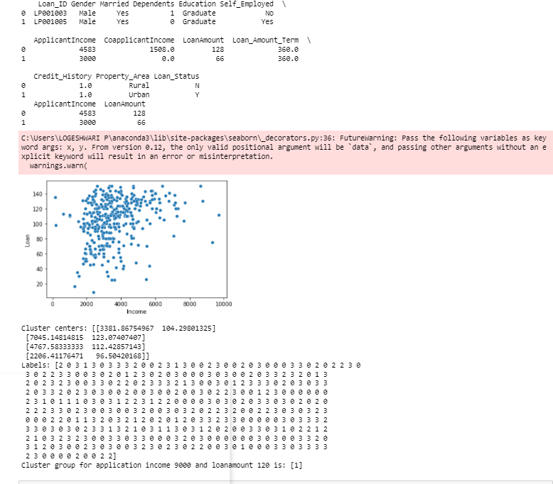

# Implementation of K-Means Clustering Algorithm
## Aim
To write a python program to implement K-Means Clustering Algorithm.

## Equipment’s required:
Hardware – PCs
Anaconda – Python 3.7 Installation
## Algorithm:
### Step1 :
Import pandas.

### Step2 :
Read the file using read_csv.

### Step3 :
Plot the points using sns.scatterplot.

### Step4 :
Display the number of rows.

### Step5 :
Predict the class using .predict and print.

## Program:
```
import pandas as pd
from sklearn.cluster import KMeans
import matplotlib.pyplot as plt
import seaborn as sns
x1=pd.read_csv('clustering.csv')
print(x1.head(2))
x2=x1.loc[:,['ApplicantIncome','LoanAmount']]
print(x2.head(2))
x=x2.values
sns.scatterplot(x[:,0],x[:,1])
plt.xlabel('Income')
plt.ylabel('Loan')
plt.show()
kmeans=KMeans(n_clusters=4)
kmeans.fit(x)
print("Cluster Centers:",kmeans.cluster_centers_)
print("Labels:",kmeans.labels_)
predict_class=kmeans.predict([[9000,1200]])
print("Cluster group for application income 9000 and loanamount 120 is",predict_class)
```
## Output:



## Result
Thus the K-means clustering algorithm is implemented and predicted the cluster class using python program.